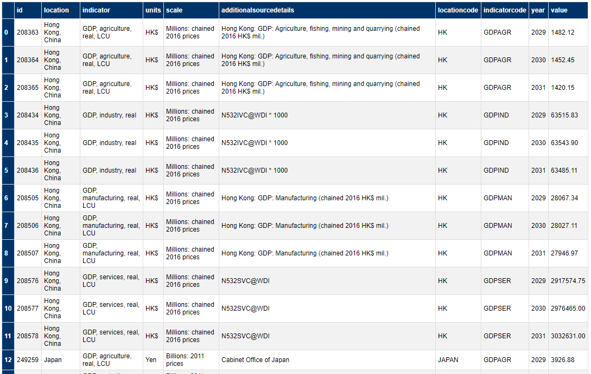

# FastAPI-Wrapper CLI & APIness Streamlit App

> Arvindra Sehmi, Oxford Economics Ltd. | [Website](https://www.oxfordeconomics.com/) | [LinkedIn](https://www.linkedin.com/in/asehmi/)
> (Updated: 21 April, 2021)

`fastapi-wrapper` is motivated by the work of [jrieke](https://github.com/jrieke/fastapi-csv) on `fastapi-csv`.

_Create APIs from data files within seconds, using FastAPI_

This is a Python package to create APIs from data files (Excel XLSX and CSV only), using a lightweight & 
fully customizable wrapper around [FastAPI](https://fastapi.tiangolo.com/). Endpoints 
and query parameters are auto-generated based on the column names and data types in the 
data file. Its contents is written to either a temporary in-memory or persistent `SQLite` database, so the API can be blazing 
fast, even for huge files, especially for the in-memory case.

## TOC
- Why did I implement this?
- Mods
- Streamlit App Demo
- CLI Demo
- How to use fastapi-wrapper from the command line (CSV Example)
- How to use fastapi-wrapper from Python (XLSX Example)
- Example using the API in Power BI
- My thoughts on additional requirements
- The APINESS Factor
- Resources
- Epilogue

---


## Why did I implement this?

- To enhance and extend some internal Oxford Economics (OE) tools, e.g., [Modelit](https://github.com/OxfordEconomics/Streamlit-Projects/tree/master/Modelit)
  project [OE clients only, sorry!] so that [MDL-generated data exports](https://www.oxfordeconomics.com/techlabs/mdl-use-case-automating-model-solutions)
  can enjoy some _apiness_ `:-)`
- An easy way to expose _Excel-Files-as-Databases_ with a _REST API_ so they can be queried in `Streamlit`, and other apps such as `Power BI` and `Jupyter Notebooks`
- It can be useful for mocking data sources in CI/CD testing pipelines
- To experiment with [FastAPI](https://fastapi.tiangolo.com/), which has garnered a lot of attention and enterprise adoption (e.g. Microsoft) 

---


## Mods

The changes I made to [jrieke's](https://github.com/jrieke/fastapi-csv) original implementation are:

- Built a `Streamlit` application to:
  - Interactively upload one or more Excel data files
  - Configure each file's API endpoint
  - Generate a SQLite database, for all or each file, and
  - Launch FastAPI to serve the APIs
- Simplified naming of auto-generated query params added to the API
- Added `cols`, `where` and `cmd` query params for richer SQL queries of the endpoint (including defense against destructive SQL injections)
- Error handling
- Rendering response data as JSON and HTML
- Restructured return json results to add some metadata useful for debugging, for example:

```json
{   "metadata": {
        "database": "macro",
        "table": "custommacromodel_l_a",
        "sql_query": "SELECT * FROM custommacromodel_l_a WHERE (Location IN (\"United Kingdom\")) LIMIT 2",
        "full_count": 1278,
        "results_count": 1278
    },
    "data": [
        {
        "id": 457027,
        "Location": "United Kingdom",
        "Indicator": "GDP, agriculture, real, LCU",
            .
            .
            .
        "Year": 1980,
        "Value": 8210.16
        },
            .
            .
            .
    ]
}
```
---


## Streamlit App Demo

In this demo:

1. The user successively uploads one or more XLSX/CSV files
2. The app displays a row of edit fields for each uploaded file allowing the user to configure the database name, table name, and update mode
3. The configuration and files are submitted for processing, that is, databases are generated and populated with their file data and (Fast)API endpoints are created
4. After the user has uploaded and processed all their files, the FastAPI server is started making the API live
5. The user interacts with the live API via a browser


> IMPORTANT: The API is launched via `uvicorn` on its own thread and can't be killed. The only way currently to stop uvicorn and Streamlit is to kill the Python host process.

---


## CLI Demo

(_This demo gives you a good idea of the command line system. Note, the latest version differs slightly in terms of the API base URL format used._)


---


## How to use fastapi-wrapper from the command line (CSV Example)

### Installing the CLI

```bash
# Use pip in the root folder
pip install .

# Or, running setup from the root folder
python setup.py install
```

```bash
# To uninstall
pip uninstall fastapi-wrapper
```

### Running the CLI

Use the CSV data file (472718 rows) in this repo for testing ([CustomMacroModel_L_A.csv](CustomMacroModel_L_A.csv)). To start
an API, run one of the following commands:

```bash
# From file
fastapi-wrapper CustomMacroModel_L_A.csv

# Directly from URL
fastapi-wrapper https://raw.githubusercontent.com/asehmi/fastapi-wrapper/main/CustomMacroModel_L_A.csv

# If you provide an xlsx file, then add XLSX as the second argument on the command line (see Python example below)
```

Either command should start a `fastapi` instance in `uvicorn` (_a lightning-fast ASGI web server_) on the default `host` and `port`.

```
(base) C:\Dev\apiness>fastapi-wrapper custommacromodel_l_a.csv --host localhost --port 8000 --database macro
fastapi_wrapper v0.4.2
Creating > Database: macro | From file: custommacromodel_l_a.csv | Type: CSV | Update mode: replace
Initializing FastAPI_Wrapper...
Starting API server (uvicorn)...
Check out the API docs at http://localhost:8000/docs | http://localhost:8000/redoc
--------------------------------------------------------------------------------
INFO:     Started server process [18828]
INFO:uvicorn.error:Started server process [18828]
INFO:     Waiting for application startup.
INFO:uvicorn.error:Waiting for application startup.
INFO:     Application startup complete.
INFO:uvicorn.error:Application startup complete.
INFO:     Uvicorn running on http://localhost:8000 (Press CTRL+C to quit)
INFO:uvicorn.error:Uvicorn running on http://localhost:8000 (Press CTRL+C to quit)
```


### Command line switches

`fastapi-wrapper --help` command line switch prints some useful info:

```bash
(base) C:\Dev\apiness>fastapi-wrapper --help
fastapi_wrapper v0.4.2
Usage: fastapi-wrapper [OPTIONS] DATA_PATH [DATA_FORMAT]:[CSV|XLSX]

  Create APIs from CSV or XLSX data files within seconds, using fastapi.

  Just pass along a data file and this command will start a fastapi instance
  with auto-generated endpoints & query parameters to access the data.

Arguments:
  DATA_PATH                 Path to the data file  [required]
  [DATA_FORMAT]:[CSV|XLSX]  Format of data file  [default: CSV]

Options:
  --database TEXT                 Sqlite DB name. Defaults to in-memory DB.
                                  [default: :memory:]

  --if-exists [replace|append|fail]
                                  Defines treatment of database if it exists
                                  [default: replace]

  --start-server / --no-start-server
                                  Start server.  [default: True]
  --host TEXT                     IP to run the API on  [default: 127.0.0.1]
  --port INTEGER                  Port to run the API on  [default: 8000]
  --help                          Show this message and exit.
  ```

For example:

```bash
fastapi-wrapper custommacromodel_l_a.csv --host localhost --port 8000 --database macro
```

- `fastapi-wrapper` auto-generates endpoints and query parameters based on the CSV file
- Here, the API will have an endpoint `/macro/custommacromodel_l_a`
- The URL fragments are `/<database name | :memory:>/<database table name>`
- The table name is the same as the file name, but lowercased
- The endpoint can be queried using the imported file's column names
- And finally, a `SQLite` database named `macro.db`, will also be created

> IMPORTANT: The endpoint fragments and column names used as query parameters are lowercased. Spaces in their names will be replaced with underscore ('_').

### API documentation

The auto-generated API documentation is available here:

- Interactive: http://localhost:8000/docs
- Reference: http://localhost:8000/redoc

### Querying the API

In a browser window enter the following parameterised URLs:

(_All URL fragments below are prefixed with_ `http://localhost:8000`)

- `/macro/custommacromodel_l_a?location=United Kingdom`
- `/macro/custommacromodel_l_a?location=United Kingdom&indicatorcode=GVA`

Additionally, `fastapi-wrapper` creates some convenience query parameters for specific data types, e.g. 

- `/macro/custommacromodel_l_a?year_gt=2020` (for int/float)
- `/macro/custommacromodel_l_a?location_in=Kingdom` (for string, watch out: this one is case sensitive!)
- `/macro/custommacromodel_l_a?year_lte=2020&Location_in=United Kingdom&indicator_in=GDPAGR`

Numerical values can be quoted or not. Strings should not be quoted in query values.

You can explicitly specify SQL "where" _read-only_ clauses using the `where` parameter. Destructive SQL commands and clauses cause an exception. 

- `/macro/custommacromodel_l_a?where=Year>="2029" AND Year<="2031" AND Indicator LIKE "%GDP%" AND LocationCode IN ("JAPAN","HK")`

SQL command modifiers can be added to using the `cmd` parameter.

- `/macro/custommacromodel_l_a?where=Year>=2030 AND Year<=2031 AND Location="United Kingdom" AND Indicator LIKE "%GDP%"&cmd=LIMIT 5`

Note, strings in `where` and `cmd` values are quoted and must obey _SQL syntax rules_.

The columns returned by a query can be specified (including aliases) with the `cols` parameter.

- `/macro/custommacromodel_l_a?where=Year>="2029" AND Year<="2031" AND LocationCode IN ("JAPAN","HK")&cols=Location, Indicator, Year, Value&cmd=LIMIT 10`
- `/macro/custommacromodel_l_a?where=LocationCode IN ("JAPAN","HK")&cols=LocationCode as LOCCODE, Indicator as VAR, Year as YR, Value as VAL&cmd=LIMIT 10`

> IMPORTANT: Where column names are referenced as query parameters (not parameter values), they must be lowercased. When they appear as values
> for `where` and `cols` parameters, case does <u>not</u> matter.


### Rendering results as HTML

By default results are rendered as JSON where tabluar data is available on the `data` key. To render the data as an HTML table, simply add a `tohtml` parameter to the query.

- `/macro/custommacromodel_l_a?where=Year>="2029" AND Year<="2031" AND Indicator LIKE "%GDP%" AND LocationCode IN ("JAPAN","HK")&tohtml`



---


## How to use fastapi-wrapper from Python (XLSX Example)

Ensure the required packages are installed:

```bash
pip install -r requirements.txt
```

Create a file `app.py`:

```python
from fastapi_wrapper import FastAPI_Wrapper

app = FastAPI_Wrapper().create_database(database='gcfs', data_path='GCFS Countries.xlsx', data_format='XLSX', if_exists='replace')
```

Start from terminal just like a normal fastapi app:

```bash
uvicorn app:app
```

OR, create a file `main.py`:

```python
from fastapi_wrapper import FastAPI_Wrapper
import uvicorn

app = FastAPI_Wrapper().create_database(database='gcfs', data_path='GCFS Countries.xlsx', data_format='XLSX', if_exists='replace')
uvicorn.run(app, host='localhost', port='8000')
```

Start from terminal just like a normal python app:

```bash
python main.py
```

The queries are similar to the CSV case above, except the endpoint is different:

- `/gcfs/gcfs_countries?cmd=LIMIT 1000`
- `/gcfs/gcfs_countries?where=Location LIKE "%Kingdom%" OR Location LIKE "%States%"`

This shows use of `cols` query parameter:

- `/gcfs/gcfs_countries?cols=location, indicator, year, value&location_in=United Kingdom`

This shows use of `_ina` and `_inz` query parameters to match at the beginning and end of values respectively, and column name aliases:

- `/gcfs/gcfs_countries?location_in=United Kingdom&indicator_code_ina=GDP&indicator_code_inz=USC&cols=Location as LOC,Indicator as VAR,Indicator_Code as VARCODE,Value as VAL,Year as YR`

### Extending the API

The cool thing: `FastAPI_Wrapper` only extends `FastAPI`. Therefore, you can do 
all the stuff you can do with a normal fastapi instance, e.g. add a new endpoint:

```python
# Add a new endpoint, just like in normal fastapi
@app.get("/hello")
def hello(self):
    return {"Hello:", "World"}
```

This way you can easily modify endpoints previously generated from the CSV file.

### Updating data

If your CSV file changes, you can update the API data with:

```python
app.update_database()
```

Note, this will only update the data, not the API endpoints or query parameters. 
To do that, you need to create a new `FastAPI_Wrapper` instance or re-start `uvicorn`.

---


## Example using the API in Power BI

See the file `TestReport.pbix` (requires the free PBI Desktop Application on Windows)

### M-Language data transformation script 


### Power BI report 


---


## My thoughts on additional requirements

`FastAPI_Wrapper` is a neat idea, but "_What is the real value prop?_"

- Needs a decent SQL DB, Redis, or a cloud DB. SQLite is not slow,
  apparently, _SQLite is faster than nearly every other database at read-heavy
  use cases_, and it's super [versatile](https://sqlite.org/whentouse.html),
  but I think we need a streaming query API to make it easier to consume in BI tools.

- This program relies on the built-in SQLite Python binding, and may come
  with [limits](https://www.sqlite.org/limits.html) we don't want. Need to investigate:
    - [SuperSQLite](https://github.com/plasticityai/supersqlite)
    - [r/SuperSQLite: SQLite library for Python](https://news.ycombinator.com/item?id=20775992), and
    - [Going Fast with SQLite and Python](https://charlesleifer.com/blog/going-fast-with-sqlite-and-python/)

- Would it be better supporting GraphQL?

- Extend to handle TXT files, different table layouts, etc.

- Have the ability to import from Excel named ranges / data tables.

- Break tight coupling between the api endpoint and the Excel filename
    - [DONE] User should interact with an "upload & generate api" workflow
    - Provide a namespace to isolate APIs from one another (could be the organisation name,
      user name, etc.) - details can come from a login profile - useful for online deployments
    - [DONE implicitly] Specify the endpoint name
    - [DONE except for namespace] Upload file and provision API using file contents type information, namespace, and endpoint name
    - Access API via: `/namespace/endpoint_name?....`

- During provisioning workflow, allow an API access key to be generated for the endpoint
  (or for all endpoints in the login account)
    - To access API protected endpoints, the user should send an `apikey` header variable
    - (Study FastAPI docs re: protecting endpoints)

- Allow users to clone an API endpoint

- Provide integrations (which will require system `upload` and `management` APIs)
    - Dropbox / OneDrive / GDrive listeners
    - Zapier, IFTTT, etc.

- Customized client-side error handling hooks (400s, 500s, etc.)

- The autogenerated API docs should be specific to each `namespace + endpoint` combination, rather than the `host domain`
    - `http://localhost:8000/namespace/endpoint/docs`, <u>not</u>
    - `http://localhost:8000/docs`

---


## The APINESS Factor


---


## Resources

There are tons of resources on the web. These are some I have looked at:

- [FastAPI](https://fastapi.tiangolo.com/)
- [Quickly Develop Highly Performant APIs with FastAPI & Python](https://livecodestream.dev/post/quickly-develop-highly-performant-apis-with-fastapi-python/)
- [Deploying a Python FastAPI on Azure App Service](https://techcommunity.microsoft.com/t5/apps-on-azure/deploying-a-python-fastapi-on-azure-app-service/m-p/1757016)
- [How to capture arbitrary paths at one route in FastAPI](https://stackoverflow.com/questions/63069190/how-to-capture-arbitrary-paths-at-one-route-in-fastapi)
- [Sharing python objects across multiple workers](https://stackoverflow.com/questions/65686318/sharing-python-objects-across-multiple-workers)
- [Why You Should Try FastAPI](https://www.queworx.com/blog/why-you-should-try-fastapi/)
- [Video: How to Deploy FastAPI on Azure App Service in just 30 minutes](https://www.youtube.com/watch?v=oLdEI3zUcFg)
- [Turn your Excel Workbook into a SQLite Database](https://towardsdatascience.com/turn-your-excel-workbook-into-a-sqlite-database-bc6d4fd206aa)
- [Uvicorn + FastAPI](https://stackoverflow.com/questions/57412825/how-to-start-a-uvicorn-fastapi-in-background-when-testing-with-pytest)
- [Dynamic/runtime method creation (code generation) in Python](https://stackoverflow.com/questions/533382/dynamic-runtime-method-creation-code-generation-in-python)
- [FastAPI as primary ASGI app](https://github.com/miguelgrinberg/python-socketio/issues/332#issuecomment-712928157)
- [Python Threading](https://pymotw.com/2/threading/)
- [DbVisualizer](https://www.dbvis.com/)
- [SQLite command line shell](https://sqlite.org/cli.html)

### Datasette

This is an excellent, very complete solution of Excel files >> SQLite with vizualisations.

(_Found after I started my project; so is there any need to develop this solution further??_)

- [Website](https://datasette.io/)
- [Video](https://simonwillison.net/2021/Feb/7/video/)

---


## Epilogue

Looks like some folks are making a living from this sort of thing!

- [Google Sheet as JSON API. Excel Spreadsheet as API.](https://sheet2api.com/)
- DreamFactory
  - [API management](https://www.dreamfactory.com/)
  - [Guide](https://guide.dreamfactory.com/)
  - [Whitepaper](https://www.dreamfactory.com/downloads/dreamfactory-technical-whitepaper.pdf)
  - [Blog](https://blog.dreamfactory.com/)
  - [GitHub](https://github.com/dreamfactorysoftware)
  - [Resources](https://www.dreamfactory.com/resources)
- [Create an API from an Excel Spreadsheet](https://bridge.buddyweb.fr/en)
- [Convert Excel into OpenAPI](https://www.alchemyj.io/)
- [CalcFusion - Transform Excel Spreadsheet into APIs](http://calcfusion.com/)
