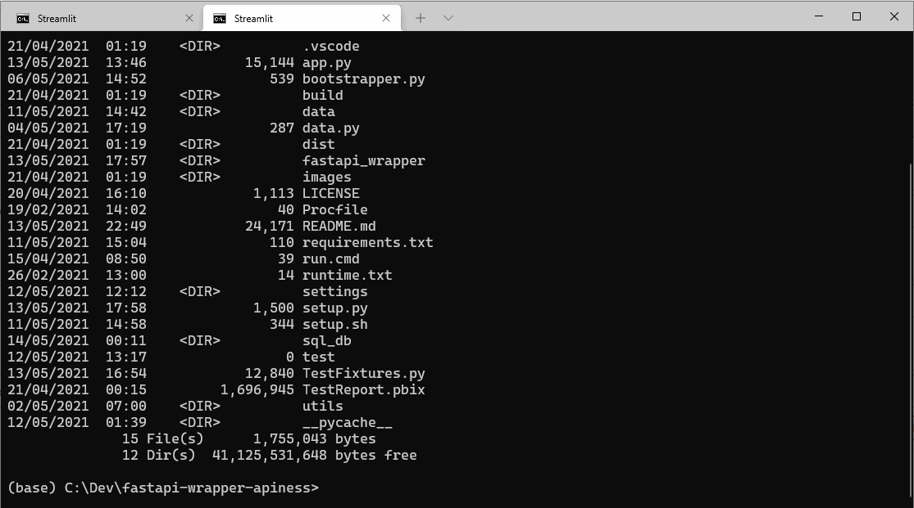
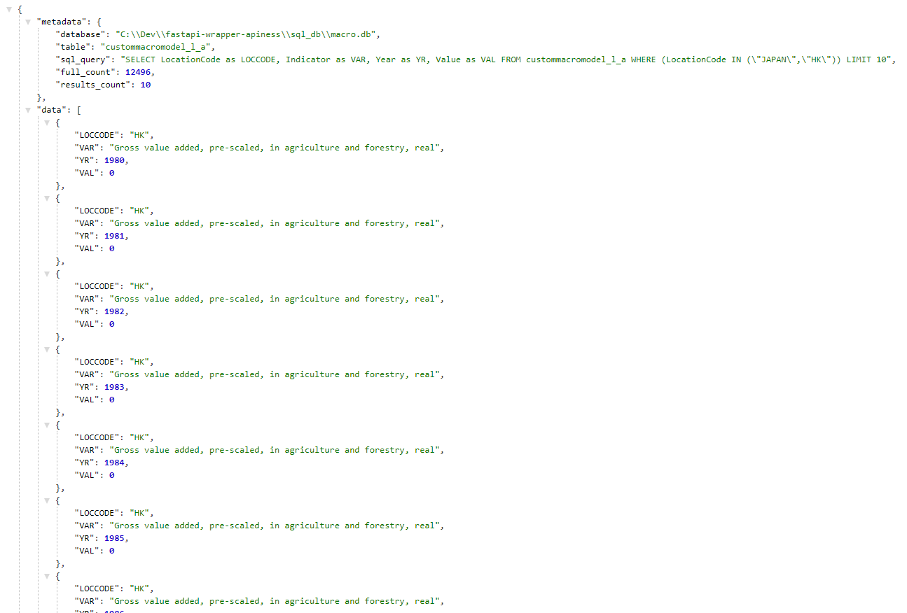

# APINESS
> _A FastAPI CLI & Streamlit App wrapper for Excel files_

> Arvindra Sehmi, Oxford Economics Ltd. | [Website](https://www.oxfordeconomics.com/) | [LinkedIn](https://www.linkedin.com/in/asehmi/)

> Updated: 13 May, 2021

---


## _Create APIs from data files within seconds, using FastAPI_

`fastapi-wrapper` is motivated by the work of [jrieke](https://github.com/jrieke/fastapi-csv) on `fastapi-csv`.

This is a Python package and Streamlit application to create APIs from data files (Excel XLSX and CSV only),
using a lightweight & fully customizable wrapper around [FastAPI](https://fastapi.tiangolo.com/). Endpoints 
and query parameters are auto-generated based on the column names and data types in the 
data file. Its contents is written to either a temporary in-memory or persistent `SQLite` database, so the
API can be blazing fast, even for huge files, especially for the in-memory case.

In addition, alongside the generated database(s), a configuration database is created with all the
metadata required to recreate the API on the databases without having to load the original source data files.
In effect, a package comprising the data databases and associated configurtion database makes the API
portable to any machine that has the `fastapi-wrapper` CLI tool installed.

Read on to see how to get this little magic into your data handling workflows.

## TOC
- Why I implemented this?
- Value of SQL Model DBs to OE?
- Mods
- Streamlit App Demo
  - Running the Streamlit app
  - Downloading generated SQLite database
- CLI Demo
- How to use fastapi-wrapper from the command line (CSV Example)
  - Installing the CLI
  - Running the CLI
  - Command line switches
  - API documentation
  - Querying the API
  - Rendering results as HTML
- How to use fastapi-wrapper from Python (XLSX Example)
  - Extending the API
  - Updating data
- Example using the API in Power BI
- How to directly connect to SQLite database in Excel
- My thoughts on additional requirements
- The APINESS Factor
- Resources
- Epilogue

---


## Why I implemented this?

- To enhance and extend some internal Oxford Economics (OE) tools, e.g., [Modelit](https://github.com/OxfordEconomics/Streamlit-Projects/tree/master/Modelit)
  project [available to OE clients only, sorry!] so that [MDL-generated data exports](https://www.oxfordeconomics.com/techlabs/mdl-use-case-automating-model-solutions)
  can enjoy some _apiness_ `:-)`
- An easy way to expose _Excel-Files-as-Databases_ with a _REST API_ so they can be queried in `Streamlit`, and other apps such as `Power BI`, `Tableau` and `Jupyter Notebooks`
- It can be useful for mocking data sources in CI/CD testing pipelines
- To experiment with [FastAPI](https://fastapi.tiangolo.com/), which has gained much attention and enterprise adoption (e.g. Microsoft) 


## Value of SQL Model DBs to OE?

- Command line tooling lends itself to pipeline batch automation working with OE's economic model bases
- Enables OE staff to use a standard, high performance and scaleable data format and query language. This makes for a
more flexible and efficient workflow than can eb achieved using OE's native model database tools
- SQL databases are portable across multiple device form factors and operating systems. This is especially true of SQLite databases.
- SQL databases are easily shared on local, cloud and edge data networks
- SQL databases are better for data analytics and vizualization tasks, e.g. direct connectors in Power BI & Tableau
- Ability to store multiple model bases in a single SQL database, e.g. multiple scenarios or model vintages can be stored in one SQL database
- It's easy to export data to multiple target formats from a SQL DB using commonly available tools and programming languages,
e.g. [DB Browser for SQLite](https://sqlitebrowser.org/)
- Can be used to augment model data exports from OE's Online Global Economic Model (SkyMod) API

---


## Mods

The changes I made to [jrieke's](https://github.com/jrieke/fastapi-csv) original implementation are:

- Built a `Streamlit` application to:
  - Interactively upload one or more Excel data files
  - Configure each file's API endpoint
  - Generate a SQLite database, for all or each uploaded Excel data file
  - Generate an API routes metadata configuration file which allows you to deploy an API independently of the source Excel data files
    - `Databases + API Routes Config = BYOAPI`! 
  - Allow downloads of generated SQLite data databases and routes configuration databases, and
  - Launch FastAPI to serve the APIs. Both _test_ and _live_ modes are supported to enable iterative 
  development. Live running APIs can be stopped from within the `Streamlit` application.
- Variety of auto-generated query params has been increased, including addition of `cols`, `where` and `cmd` query params for rich SQL queries of the endpoint
  - (SQL injection attacks are prevented)
- Error handling
- Response data can be rendered as JSON and HTML tables
- Json results hold some metadata useful for debugging, for example:

```json
{   "metadata": {
        "database": "c:\\Dev\\fastapi-wrapper-apiness\\sql_db\\macro.db",
        "table": "custommacromodel_l_a",
        "sql_query": "SELECT * FROM custommacromodel_l_a WHERE (Location IN (\"United Kingdom\")) LIMIT 2",
        "full_count": 1278,
        "results_count": 1278
    },
    "data": [
        {
        "id": 457027,
        "Location": "United Kingdom",
        "Indicator": "GDP, agriculture, real, LCU",
            .
            .
            .
        "Year": 1980,
        "Value": 8210.16
        },
            .
            .
            .
    ]
}
```
---


## Streamlit App Demo

In this demo:

1. The user successively uploads one or more XLSX/CSV files
2. The app displays a row of edit fields for each uploaded file allowing the user to configure the database name, table name, and update mode
3. The configuration and files are submitted for processing, that is, databases are generated and populated with their file data and (Fast)API endpoints are created
4. After the user has uploaded and processed all their files, the FastAPI server is started in test or live mode
5. The user interacts with the API via a browser


> IMPORTANT: The live API is launched via `uvicorn` on its own threaded process and can be safely killed to restart the API-building session.

### Running the Streamlit app

```bash
# sets the port number too
streamlit run --server.port 4010 app.py
```

### Downloading generated SQLite database

When the API is made live in the Streamlit application, open another browser window and enter the following URL:

(_All URL fragments below are prefixed with_ `http://localhost:8000`)

- `/download/macro.db`, or
- `/download/macro`

This assumes you have an API in the Streamlit application with a database named `macro`.

The API configuration database can be downloaded with the following URL:

- `/download/apiness_routes_config.db`

Alternatively, click on the `download` links which will be displayed in a list of deployed API endpoints in the Streamlit application.

> IMPORTANT: All databases are generated in the `./sql_db` sub-folder of the main Streamlit app directory.

---


## CLI Demo

(_This demo gives you a good idea of the command line system. Note, the latest version differs slightly in terms of the API base URL format used._)


---


## How to use fastapi-wrapper from the command line (CSV Example)

### Installing the CLI

```bash
# Use pip in the root folder
pip install .

# Or, running setup from the root folder
python setup.py install
```

```bash
# To uninstall
pip uninstall fastapi-wrapper
```

### Running the CLI

Use the CSV data file (472718 rows) in this repo for testing ([CustomMacroModel_L_A.csv](CustomMacroModel_L_A.csv)). To start
an API, run one of the following commands:

```bash
# From file
fastapi-wrapper CustomMacroModel_L_A.csv

# Directly from URL
fastapi-wrapper https://raw.githubusercontent.com/asehmi/fastapi-wrapper/main/CustomMacroModel_L_A.csv

# If you provide an xlsx file, then add XLSX as the second argument on the command line (see Python example below)
```

Either command should start a `fastapi` instance in `uvicorn` (_a lightning-fast ASGI web server_) on the default `host` and `port`.

```
(base) C:\Dev\fastapi-wrapper-apiness>fastapi-wrapper .\data\custommacromodel_l_a.csv --host localhost --port 8000 --database macro
fastapi_wrapper v0.5.5
>>> CWD: C:\Dev\fastapi-wrapper-apiness <<<
--------------------------------------------------------------------------------
>>> Applicable argument values <<<
data_path: .\data\custommacromodel_l_a.csv
data_format: CSV
database: macro
config_db: routes_config.db
if_exists: replace
start_server: True
host: localhost
port: 8000
--------------------------------------------------------------------------------
Creating > Database: macro | From file: .\data\custommacromodel_l_a.csv | Type: CSV | Update mode: replace
Initializing FastAPI_Wrapper...
Starting API server (uvicorn)...
Check out the API docs at http://localhost:8000/docs | http://localhost:8000/redoc
--------------------------------------------------------------------------------
INFO:     Started server process [14380]
INFO:uvicorn.error:Started server process [14380]
INFO:     Waiting for application startup.
INFO:uvicorn.error:Waiting for application startup.
INFO:     Application startup complete.
INFO:uvicorn.error:Application startup complete.
INFO:     Uvicorn running on http://localhost:8000 (Press CTRL+C to quit)
INFO:uvicorn.error:Uvicorn running on http://localhost:8000 (Press CTRL+C to quit)
```



### Command line switches

`fastapi-wrapper --help` command line switch prints some useful info:

```bash
(base) C:\Dev\fastapi-wrapper-apiness>fastapi-wrapper --help
fastapi_wrapper v0.5.5
>>> CWD: C:\Dev\fastapi-wrapper-apiness <<<
Usage: fastapi-wrapper [OPTIONS] [DATA_PATH]

  Create APIs from CSV or XLSX data files within seconds, using fastapi.

  Just pass along a data file and this command will start a fastapi instance
  with auto-generated endpoints & query parameters to access the data.

  APIs can also be created from previously-generated databases and their
  associated API routes configuration database.

Arguments:
  [DATA_PATH]  Path to the data file

Options:
  --data-format [CSV|XLSX]        Format of data file  [default: CSV]
  --config-db TEXT                The routes config database to be generated.
                                  Defaults to 'routes_config.db'.  [default:
                                  routes_config.db]

  --init-routes-with-config-db / --no-init-routes-with-config-db
                                  Apply supplied 'config_db' to initialize
                                  API. Assumes underlying SQLite database(s)
                                  for the API routes exist. Requires
                                  'config_db' argument. The server is always
                                  started.  [default: False]

  --database TEXT                 Sqlite DB name. Defaults to in-memory DB.
                                  [default: :memory:]

  --if-exists [replace|append|fail]
                                  Defines treatment of database if it exists
                                  [default: replace]

  --start-server / --no-start-server
                                  Start server.  [default: True]
  --host TEXT                     IP to run the API on  [default: 127.0.0.1]
  --port INTEGER                  Port to run the API on  [default: 8000]
  --install-completion [bash|zsh|fish|powershell|pwsh]
                                  Install completion for the specified shell.
  --show-completion [bash|zsh|fish|powershell|pwsh]
                                  Show completion for the specified shell, to
                                  copy it or customize the installation.

  --help                          Show this message and exit.
  ```

For example:

```bash
fastapi-wrapper .\data\custommacromodel_l_a.csv --host localhost --port 8000 --database macro
```

- `fastapi-wrapper` auto-generates endpoints and query parameters based on the CSV file
- Here, the API will have an endpoint `/macro/custommacromodel_l_a`
- The URL fragments are `/<database name | :memory:>/<database table name>`
- The table name is the same as the file name, but lowercased
- The endpoint can be queried using the imported file's column names

> IMPORTANT: The endpoint fragments and column names used as query parameters are lowercased. Spaces in their names will be replaced with underscore ('_').

- A `SQLite` database named `macro.db` will be created in `.\sql_db` sub-directory
- And finally, another `SQLite` database named `routes_config.db` will be created in `.\sql_db` sub-directory. You can supply
a custom name for your routes configuration database using the the `--config-db` switch.


### Portable API (BYOAPI!)

The routes configuration database always generated when `fastapi-wrapper` is run with an Excel data file, can be used along with the generated data database to deploy your API.

For example:

```bash
# Running this command generates a custom configuration: my_custom_routes.db
fastapi-wrapper .\data\custommacromodel_l_a.csv --config-db my_custom_routes.db --host localhost --port 8000 --database macro

# The custom configuration database (my_custom_routes.db) can then be used to deploy the API, given the data database (macro.db) is in '.\sql_db'
fastapi-wrapper --config-db my_custom_routes.db --init-routes-with-config-db --host localhost --port 8000
```

> IMPORTANT: The above command will start the `FastAPI` server exposing endpoints described by metadata held in the `routes_config` table of `my_custom_routes.db` configuration database.

> If you want to create more than one route definition in the configuration database, you must use the Streamlit application. The CLI supports only one data and route configuration database at a time.  

### API documentation

When the API server is running, auto-generated API documentation is available here:

- Interactive: [http://localhost:8000/docs](http://localhost:8000/docs)
- Reference: [http://localhost:8000/redoc](http://localhost:8000/redoc)

### Querying the API

When the API server is running, open a browser window and enter the following parameterised URLs:

(_All URL fragments below are prefixed with_ `http://localhost:8000`)

- `/macro/custommacromodel_l_a?location=United Kingdom`
- `/macro/custommacromodel_l_a?location=United Kingdom&indicatorcode=GVA`

Additionally, `fastapi-wrapper` creates some convenience query parameters for specific data types, e.g. 

- `/macro/custommacromodel_l_a?year_gt=2020` (for int/float)
- `/macro/custommacromodel_l_a?location_like=Kingdom` (for string, watch out: this one is case sensitive!)
- `/macro/custommacromodel_l_a?year_lte=2020&location_like=United Kingdom&indicator_like=GDPAGR`

Numerical values can be quoted or not. Strings should not be quoted in query values.

You can explicitly specify SQL "where" _read-only_ clauses using the `where` parameter. Destructive SQL commands and clauses cause an exception. 

- `/macro/custommacromodel_l_a?where=Year>="2029" AND Year<="2031" AND Indicator LIKE "%GDP%" AND LocationCode IN ("JAPAN","HK")`

SQL command modifiers can be added to using the `cmd` parameter.

- `/macro/custommacromodel_l_a?where=Year>=2030 AND Year<=2031 AND Location="United Kingdom" AND Indicator LIKE "%GDP%"&cmd=LIMIT 5`

Note, strings in `where` and `cmd` values are quoted and must obey _SQL syntax rules_.

The columns returned by a query can be specified (including aliases) with the `cols` parameter.

- `/macro/custommacromodel_l_a?where=Year>="2029" AND Year<="2031" AND LocationCode IN ("JAPAN","HK")&cols=Location, Indicator, Year, Value&cmd=LIMIT 10`
- `/macro/custommacromodel_l_a?where=LocationCode IN ("JAPAN","HK")&cols=LocationCode as LOCCODE, Indicator as VAR, Year as YR, Value as VAL&cmd=LIMIT 10`

> IMPORTANT: Where column names are referenced as query parameters (not parameter values), they must be lowercased. When they appear as values
> for `where` and `cols` parameters, case does <u>not</u> matter.



### Rendering results as HTML

By default results are rendered as JSON where tabluar data is available on the `data` key. To render the data as an HTML table, simply add a `tohtml` parameter to the query.

- `/macro/custommacromodel_l_a?where=Year>="2029" AND Year<="2031" AND Indicator LIKE "%GDP%" AND LocationCode IN ("JAPAN","HK")&tohtml`


---


## How to use fastapi-wrapper from Python (XLSX Example)

Ensure the required packages are installed:

```bash
pip install -r requirements.txt
```

Create a file `app.py`:

```python
from fastapi_wrapper import FastAPI_Wrapper

app = FastAPI_Wrapper().create_database(database='gcfs', data_path='GCFS Countries.xlsx', data_format='XLSX', if_exists='replace')
```

Start from terminal just like a normal fastapi app:

```bash
uvicorn app:app
```

OR, create a file `main.py`:

```python
from fastapi_wrapper import FastAPI_Wrapper
import uvicorn

app = FastAPI_Wrapper().create_database(database='gcfs', data_path='GCFS Countries.xlsx', data_format='XLSX', if_exists='replace')
uvicorn.run(app, host='localhost', port='8000')
```

Start from terminal just like a normal python app:

```bash
python main.py
```

The queries are similar to the CSV case above, except the endpoint is different:

- `/gcfs/gcfs_countries?cmd=LIMIT 1000`
- `/gcfs/gcfs_countries?where=Location LIKE "%Kingdom%" OR Location LIKE "%States%"`

This shows use of `cols` query parameter:

- `/gcfs/gcfs_countries?cols=location, indicator, year, value&location_like=United Kingdom`

This shows use of `_begin` and `_end` query parameters to match at the beginning and end of values respectively, and column name aliases:

- `/gcfs/gcfs_countries?location_like=United Kingdom&indicator_code_begin=GDP&indicator_code_end=USC&cols=Location as LOC,Indicator as VAR,Indicator_Code as VARCODE,Value as VAL,Year as YR`

### Extending the API

The cool thing: `FastAPI_Wrapper` only extends `FastAPI`. Therefore, you can do 
all the stuff you can do with a normal fastapi instance, e.g. add a new endpoint:

```python
# Add a new endpoint, similar to normal FastAPI, assuming app is an instance of FastAPI_Wrapper()
@app.get("/hello")
def hello(self):
    return {"Hello:", "World"}
```

This way you can easily modify endpoints previously generated from the CSV file.

### Updating data

If your CSV file changes, you can update the API data with:

```python
app.update_database()
```

Note, this will only update the data, not the API endpoints or query parameters. 
To do that, you need to create a new `FastAPI_Wrapper` instance or re-start `uvicorn`.

---


## Example using the API in Power BI

See the file `TestReport.pbix` (requires the free PBI Desktop Application on Windows)

### M-Language data transformation script 


### Power BI report 


---

## How to directly connect to SQLite database in Excel

Whilst you can use the generated API endpoint to get data into Excel (via `Data > Get Data > From Other Sources > From Web` menu) or via `Power Query` as used in the `Power BI` example decribed earlier, you can also connect directly to the generated SQLite database that was generated in the process of creating the API endpoint. Here are the steps to take:

1. Install a [SQLite ODBC driver](http://www.ch-werner.de/sqliteodbc/) with bitness matching the bitness of your Excel application (either 32-bit or 64-bit, e.g. `sqliteodbc_w64.exe`)
2. Open Excel and create a new worksheet
3. Open `Data > Get Data > From Other Sources > Blank Query` menu
4. In the `Power Query Editor`, select `Home > Query Ribbon Section > Advanced Editor`
5. Paste this code block into the editor:

    ```code
    let
        Source = Odbc.DataSource("driver={SQLite3 ODBC Driver};database=full-path-to-db;dsn=SQLite3 Datasource", [HierarchicalNavigation=true]),
        data_Table = Source{[Name="data_table_name",Kind="Table"]}[Data]
    in
        data_Table
    ```

    Replace `full-path-to-db` and `data_table_name` with your custom values. For example:

    ```code
    let
        Source = Odbc.DataSource("driver={SQLite3 ODBC Driver};database=C:\data\test.db;dsn=SQLite3 Datasource", [HierarchicalNavigation=true]),
        test_Table = Source{[Name="test",Kind="Table"]}[Data]
    in
        test_Table
    ```

    Note, you can build this Power Query manually, step-by-step, using the editor tools!

6. Configure optional additional data transformation steps in Power Query Editor as required.
7. Click the `Close & Load` menu and choose where you're loading your data to.

    Ensure your don't exceed 1M rows if you're going to load the data into the worksheet; no problem if you'll load it into the Power Query Data Model, aka Veripaq.

8. When the SQLite connection is made you'll be asked to supply credentials. Normally, choosing Windows credentials should be sufficient.


> IMPORTANT: Whilst Direct Query (via API or DB connection) is cool, it is always going to be slower than importing the data. See [this Twitter thread](https://twitter.com/InsightsMachine/status/1388461088409223179/photo/1) and [this video](https://www.youtube.com/watch?v=L3uT-cn_eO8).

---

## My thoughts on additional requirements

`FastAPI_Wrapper` is a neat idea, but "_What is the real value prop?_"

- Needs a decent SQL DB, Redis, or a cloud DB. SQLite is not slow,
  apparently, _SQLite is faster than nearly every other database at read-heavy
  use cases_, and it's super [versatile](https://sqlite.org/whentouse.html),
  but I think we need a streaming query API to make it easier to consume in BI tools.

- This program relies on the built-in SQLite Python binding, and may come
  with [limits](https://www.sqlite.org/limits.html) we don't want. Need to investigate:
    - [SuperSQLite](https://github.com/plasticityai/supersqlite)
    - [r/SuperSQLite: SQLite library for Python](https://news.ycombinator.com/item?id=20775992), and
    - [Going Fast with SQLite and Python](https://charlesleifer.com/blog/going-fast-with-sqlite-and-python/)

- Would it be better supporting GraphQL?

- Extend to handle TXT files, different table layouts, etc.

- Have the ability to import from Excel named ranges / data tables.

- [DONE] Have the ability to download databases.

- Break tight coupling between the api endpoint and the Excel filename
    - [DONE] User should interact with an "upload & generate api" workflow
    - Provide a namespace to isolate APIs from one another (could be the organisation name,
      user name, etc.) - details can come from a login profile - useful for online deployments
    - [DONE implicitly] Specify the endpoint name
    - [DONE except for namespace] Upload file and provision API using file contents type information, namespace, and endpoint name
    - Access API via: `/namespace/endpoint_name?....`

- During provisioning workflow, allow an API access key to be generated for the endpoint
  (or for all endpoints in the login account)
    - To access API protected endpoints, the user should send an `apikey` header variable
    - (Study FastAPI docs re: protecting endpoints)

- Allow users to clone an API endpoint

- Provide integrations (which will require system `upload` and `management` APIs)
    - Dropbox / OneDrive / GDrive listeners
    - Zapier, IFTTT, etc.

- Customized client-side error handling hooks (400s, 500s, etc.)

- The autogenerated API docs should be specific to each `namespace + endpoint` combination, rather than the `host domain`
    - `http://localhost:8000/namespace/endpoint/docs`, <u>not</u>
    - `http://localhost:8000/docs`

---


## The APINESS Factor


---


## Resources

There are tons of resources on the web. These are some I have looked at:

- [FastAPI](https://fastapi.tiangolo.com/)
- [Quickly Develop Highly Performant APIs with FastAPI & Python](https://livecodestream.dev/post/quickly-develop-highly-performant-apis-with-fastapi-python/)
- [Deploying a Python FastAPI on Azure App Service](https://techcommunity.microsoft.com/t5/apps-on-azure/deploying-a-python-fastapi-on-azure-app-service/m-p/1757016)
- [How to capture arbitrary paths at one route in FastAPI](https://stackoverflow.com/questions/63069190/how-to-capture-arbitrary-paths-at-one-route-in-fastapi)
- [Why You Should Try FastAPI](https://www.queworx.com/blog/why-you-should-try-fastapi/)
- [Video: How to Deploy FastAPI on Azure App Service in just 30 minutes](https://www.youtube.com/watch?v=oLdEI3zUcFg)
- [Shutting down the uvicorn server master from a FastAPI worker](https://github.com/tiangolo/fastapi/issues/1509)
- [How to get the return value from a thread in python?](https://stackoverflow.com/questions/6893968/how-to-get-the-return-value-from-a-thread-in-python)
- [Sharing python objects across multiple workers](https://stackoverflow.com/questions/65686318/sharing-python-objects-across-multiple-workers)
- [Turn your Excel Workbook into a SQLite Database](https://towardsdatascience.com/turn-your-excel-workbook-into-a-sqlite-database-bc6d4fd206aa)
- [Uvicorn + FastAPI](https://stackoverflow.com/questions/57412825/how-to-start-a-uvicorn-fastapi-in-background-when-testing-with-pytest)
- [Dynamic/runtime method creation (code generation) in Python](https://stackoverflow.com/questions/533382/dynamic-runtime-method-creation-code-generation-in-python)
- [FastAPI as primary ASGI app](https://github.com/miguelgrinberg/python-socketio/issues/332#issuecomment-712928157)
- [Python Threading](https://pymotw.com/2/threading/)
- [DbVisualizer](https://www.dbvis.com/)
- [SQLite command line shell](https://sqlite.org/cli.html)

### Datasette

This is an excellent, very complete solution of Excel files >> SQLite with vizualisations.

(_Found after I started my project; so is there any need to develop this solution further??_)

- [Website](https://datasette.io/)
- [Video](https://simonwillison.net/2021/Feb/7/video/)

---


## Epilogue

Looks like some folks are making a living from this sort of thing!

- [Google Sheet as JSON API. Excel Spreadsheet as API.](https://sheet2api.com/)
- DreamFactory
  - [API management](https://www.dreamfactory.com/)
  - [Guide](https://guide.dreamfactory.com/)
  - [Whitepaper](https://www.dreamfactory.com/downloads/dreamfactory-technical-whitepaper.pdf)
  - [Blog](https://blog.dreamfactory.com/)
  - [GitHub](https://github.com/dreamfactorysoftware)
  - [Resources](https://www.dreamfactory.com/resources)
- [Create an API from an Excel Spreadsheet](https://bridge.buddyweb.fr/en)
- [Convert Excel into OpenAPI](https://www.alchemyj.io/)
- [CalcFusion - Transform Excel Spreadsheet into APIs](http://calcfusion.com/)
